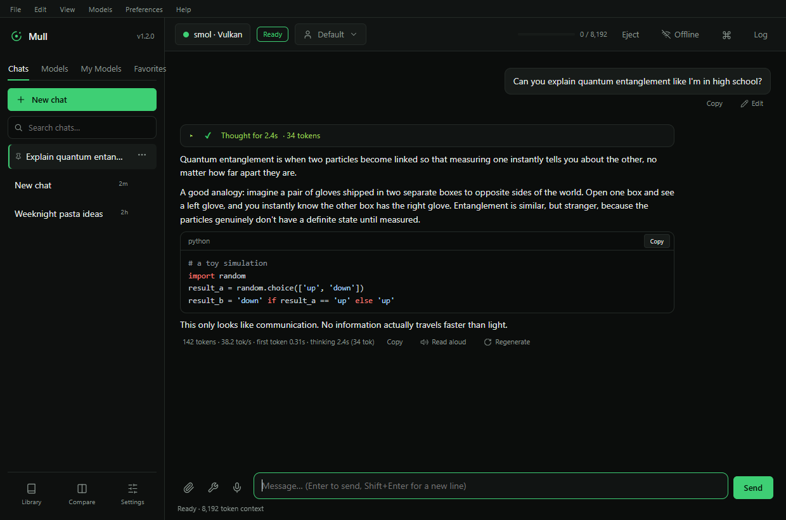
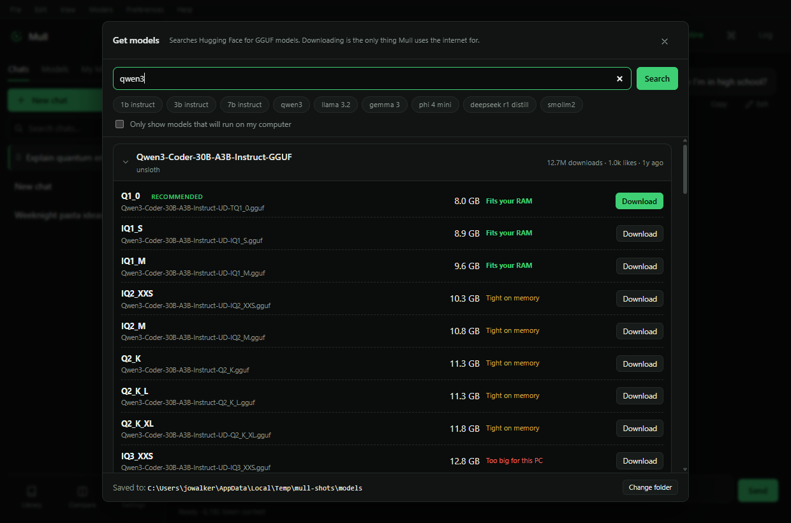
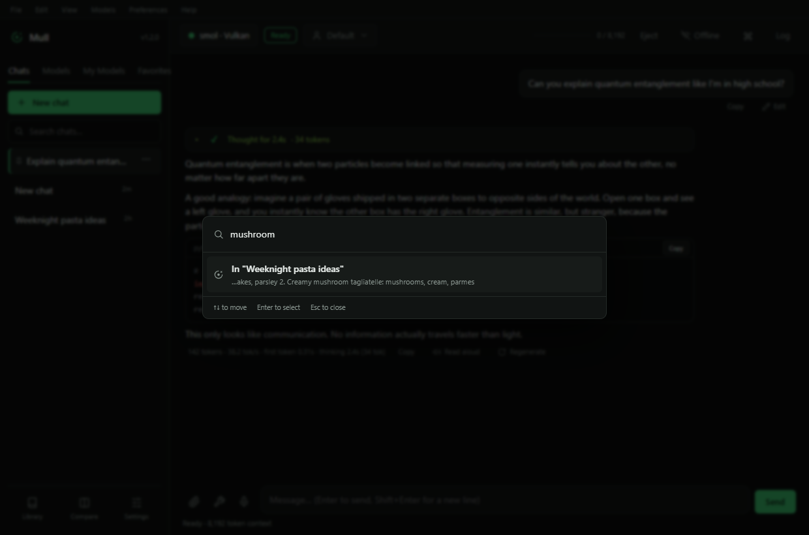
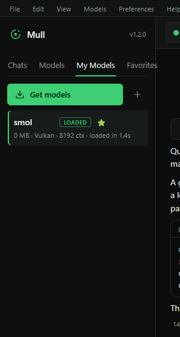

# Mull

**AI that runs entirely on your PC.**

Mull is a Windows desktop app for chatting with local AI models (GGUF format). Nothing you type is ever sent anywhere — the only time Mull touches the network at all is when you explicitly ask it to search for or download a model, and even then it switches itself back offline the moment you're done.



## Contents

- [Features](#features)
- [Installing](#installing)
- [Privacy & network access](#privacy--network-access)
- [Keyboard shortcuts](#keyboard-shortcuts)
- [Where your data lives](#where-your-data-lives)
- [Security](#security)
- [Building from source](#building-from-source)
- [License](#license)

## Features

### Chat
- Multiple chats with search (by title *and* message content), pinning, renaming, and export to Markdown or JSON
- Live streaming replies with token/second speed shown as they arrive
- See the model's reasoning as it thinks (for models that support it, e.g. DeepSeek-R1, Qwen3) — shown live or collapsed, with randomised "thinking" animations you can turn off
- Edit an earlier message and resend, regenerate any reply, copy, or have replies read aloud
- Full Markdown rendering: tables, code blocks with syntax highlighting and one-click copy, LaTeX math (KaTeX), blockquotes, links
- A **command palette** (`Ctrl+K`) that searches chats, message content, models, personas, and every action in the app from one box
- A **View** menu to toggle thinking, token stats, and the detailed status line without digging through Settings

### Models
- Runs any **GGUF** model via [node-llama-cpp](https://github.com/withcatai/node-llama-cpp) / llama.cpp, with Vulkan, CUDA, or CPU backends
- **Get Models**: search and download straight from Hugging Face, with resumable/pausable downloads and a checkbox to only show models that will actually run well on your PC
- Import models you already have: drag-and-drop `.gguf` files, pick a folder to scan, or auto-import from an existing **Ollama** or **LM Studio** install
- Per-model settings overrides (context size, GPU offload, temperature, thinking budget, and more) alongside global defaults
- A model details panel showing architecture, parameter count, quantisation, trained context length, and an estimated memory footprint
- **Favorites** — star any installed model for one-click access from its own sidebar tab
- **Compare mode** — send one prompt to two models, one after another, and see both replies side by side
- A first-run **setup guide** that scans your CPU/RAM/GPU and recommends models that will actually run well on your hardware

### Personas & prompts
- Built-in personas (Coder, Editor, Explain Simply, Tutor, Concise, Translator) plus your own, each with its own system prompt and optional temperature
- Edits to a custom persona's prompt keep a short history, so you can revert one you regret
- A library of saved, reusable prompts — type `/` in the message box to insert one

### Documents & tools
- Attach PDFs, Word documents, or text/code files to a chat; Mull retrieves the most relevant passages for each question (keyword search out of the box, or semantic search with an embedding model)
- Let a model use a calculator, the current date/time, or read files inside one folder you explicitly allow — every file access asks for your approval first, and the model can never leave that folder

### Voice
- Read any reply aloud using the voices already installed in Windows
- Dictate messages with fully offline speech recognition (Whisper) — no audio ever leaves your PC

### For developers
- An optional **OpenAI-compatible local API** (`/v1/chat/completions`, `/v1/models`) bound to `127.0.0.1` only, off by default, with an API key and CORS controls

### Extras
- System tray with a global show/hide hotkey, and the option to load your last model automatically on launch
- A themed dark/light/system UI with an animations toggle, and a **File / Edit / View / Models / Preferences / Help** menu bar for everything above
- Update checks that only ever *notify* you — Mull never downloads or installs anything on its own

<table>
<tr>
<td></td>
<td></td>
</tr>
<tr>
<td align="center"><sub>Get Models — search Hugging Face, with a checkbox to hide anything too big for your PC</sub></td>
<td align="center"><sub>The command palette (Ctrl+K) finding a match inside an old conversation</sub></td>
</tr>
</table>



## Installing

Mull ships three ways, all from [Releases](../../releases):

| Build | Best for |
|---|---|
| `Mull-Setup-<version>.exe` | Most people. Works on any GPU (Vulkan) or CPU-only. |
| `Mull-Setup-<version>-NVIDIA.exe` | NVIDIA GPU owners who want the fastest possible speeds (adds CUDA). |
| `Mull-Portable-<version>.exe` | No install, no admin rights, no registry changes. Keeps its data in a folder next to the exe — copy both to a USB stick and take it anywhere. |

All builds are currently **unsigned**, so Windows SmartScreen will warn the first time you run one ("Windows protected your PC"). Click **More info → Run anyway**. This just means the executable wasn't signed with a paid code-signing certificate — see [`BUILDING.md`](BUILDING.md) for how to add one.

## Privacy & network access

Mull is **offline by default** — not "offline unless you're using a feature that needs the internet," but genuinely no outgoing network request of any kind, enforced at the lowest level the app has (every network call goes through one function, and that function refuses to run unless you've turned access on).

- Clicking **Get models**, downloading the offline speech model, or manually checking for updates will ask first, switch to Online just long enough to do that one thing, and switch back to Offline automatically — you'll never see a stray network request sneak through.
- The first-run setup guide is the one exception that doesn't ask: since its whole purpose is showing you models to download, it turns network access on silently for that step and turns it back off the moment you leave it.
- A status-bar indicator always shows **Online** or **Offline**, and you can flip it directly at any time.
- You can also just leave it **Online** permanently in Settings → General → Network, if you'd rather it behaved like a normal app.

## Keyboard shortcuts

| Shortcut | Action |
|---|---|
| `Ctrl+K` | Command palette |
| `Enter` | Send message (`Shift+Enter` for a new line) |
| `Esc` | Close the open dialog or menu |
| `/` in the message box | Insert a saved prompt |

## Where your data lives

Installed builds keep everything in `%APPDATA%\Mull`:

- `chats.json`, `models.json`, `config.json` — your conversations, model list, and settings
- `docs\` — attached documents
- `models\` (or a folder you chose) — downloaded model files

The portable build keeps the same files in a `Mull-Data` folder next to the `.exe` instead. Uninstalling never deletes this folder automatically, so upgrading Mull never loses your chats — delete it yourself for a completely clean slate.

## Security

- Renderer runs sandboxed (`sandbox: true`), with no Node integration, a locked-down Content Security Policy, and no `<webview>` tag
- The local API server binds to `127.0.0.1` only, uses a timing-safe key comparison, and refuses to enable CORS without an API key (since that combination would let any web page open in your browser reach it)
- Every tool a model can call is either sandboxed (a real math parser, no `eval`) or explicitly confined to one folder you chose, with your approval required per file
- The GGUF download path validates repo names and rejects path traversal before writing anything to disk

Found a security issue? Please open an issue (or, for anything sensitive, contact the maintainer directly) rather than a public PR.

## Building from source

```bash
npm install
node node_modules/electron/install.js   # first time only
npm start                               # run from source
npm run dist                            # installer: dist/Mull-Setup-<version>.exe
npm run dist:cuda                       # installer with CUDA: dist/Mull-Setup-<version>-NVIDIA.exe
npm run dist:portable                   # portable build: dist/Mull-Portable-<version>.exe
```

See [`BUILDING.md`](BUILDING.md) for code signing and update-feed configuration.

## License

See `package.json` (ISC). *A `LICENSE` file hasn't been added to this repo yet — add one before publishing if you want the license to be unambiguous to people who clone it.*
